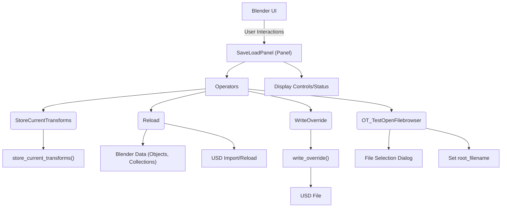
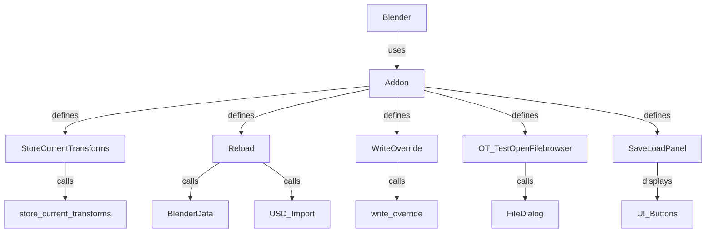
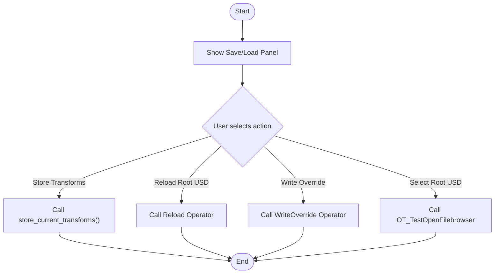
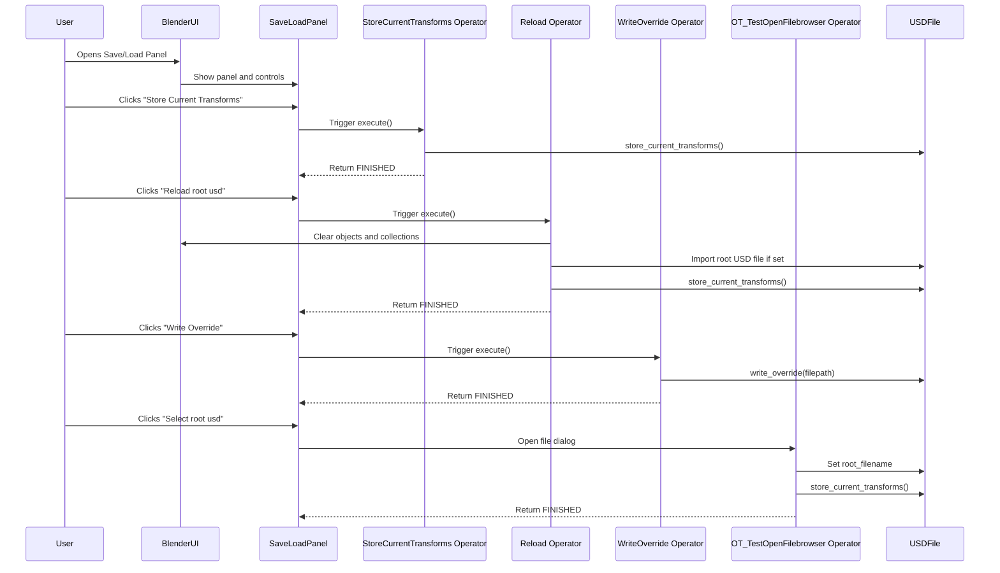
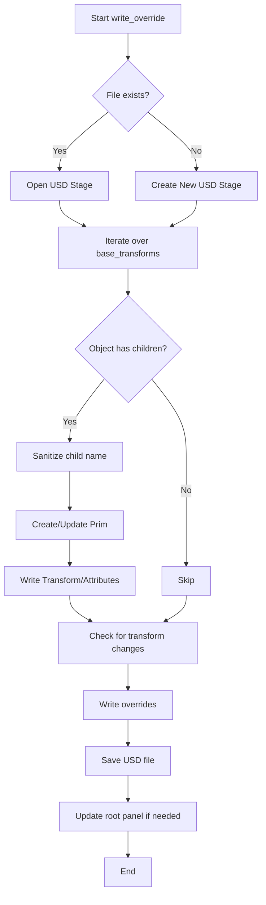

https://github.com/expenses/blender_modify_usd/blob/main/blender_modify_usd.py

# Architecture

```mermaid
graph TD
    A[Blender UI] --> |User Interactions| B["SaveLoadPanel (Panel)"]
    B --> C[Operators]
    C --> D(StoreCurrentTransforms)
    C --> E(Reload)
    C --> F(WriteOverride)
    C --> G(OT_TestOpenFilebrowser)
    D --> H["store_current_transforms()"]
    E --> I["Blender Data (Objects, Collections)"]
    E --> J[USD Import/Reload]
    F --> K["write_override()"]
    K --> L[USD File]
    G --> M[File Selection Dialog]
    G --> N[Set root_filename]
    B --> O[Display Controls/Status]
```

# Component

```mermaid
graph TD
    Blender --uses--> Addon
    Addon --defines--> StoreCurrentTransforms
    Addon --defines--> Reload
    Addon --defines--> WriteOverride
    Addon --defines--> OT_TestOpenFilebrowser
    Addon --defines--> SaveLoadPanel

    StoreCurrentTransforms --calls--> store_current_transforms
    Reload --calls--> BlenderData
    Reload --calls--> USD_Import
    WriteOverride --calls--> write_override
    OT_TestOpenFilebrowser --calls--> FileDialog
    SaveLoadPanel --displays--> UI_Buttons
```

# Activity

```mermaid
flowchart TD
    Start([Start]) --> ShowPanel[Show Save/Load Panel]
    ShowPanel --> UserAction{User selects action}
    UserAction -- Store Transforms --> CallStore["Call store_current_transforms()"]
    UserAction -- Reload Root USD --> CallReload[Call Reload Operator]
    UserAction -- Write Override --> CallWriteOverride[Call WriteOverride Operator]
    UserAction -- Select Root USD --> CallFileBrowser[Call OT_TestOpenFilebrowser]
    CallStore --> End([End])
    CallReload --> End
    CallWriteOverride --> End
    CallFileBrowser --> End
```

# Sequence

```mermaid
sequenceDiagram
    participant User
    participant BlenderUI
    participant SaveLoadPanel
    participant StoreCurrentTransformsOp as StoreCurrentTransforms Operator
    participant ReloadOp as Reload Operator
    participant WriteOverrideOp as WriteOverride Operator
    participant FileBrowserOp as OT_TestOpenFilebrowser Operator
    participant USDFile

    User->>BlenderUI: Opens Save/Load Panel
    BlenderUI->>SaveLoadPanel: Show panel and controls

    %% Store Current Transforms
    User->>SaveLoadPanel: Clicks "Store Current Transforms"
    SaveLoadPanel->>StoreCurrentTransformsOp: Trigger execute()
    StoreCurrentTransformsOp->>USDFile: store_current_transforms()
    StoreCurrentTransformsOp-->>SaveLoadPanel: Return FINISHED

    %% Reload Root USD
    User->>SaveLoadPanel: Clicks "Reload root usd"
    SaveLoadPanel->>ReloadOp: Trigger execute()
    ReloadOp->>BlenderUI: Clear objects and collections
    ReloadOp->>USDFile: Import root USD file if set
    ReloadOp->>USDFile: store_current_transforms()
    ReloadOp-->>SaveLoadPanel: Return FINISHED

    %% Write Override
    User->>SaveLoadPanel: Clicks "Write Override"
    SaveLoadPanel->>WriteOverrideOp: Trigger execute()
    WriteOverrideOp->>USDFile: write_override(filepath)
    WriteOverrideOp-->>SaveLoadPanel: Return FINISHED

    %% Select Root USD
    User->>SaveLoadPanel: Clicks "Select root usd"
    SaveLoadPanel->>FileBrowserOp: Open file dialog
    FileBrowserOp->>USDFile: Set root_filename
    FileBrowserOp->>USDFile: store_current_transforms()
    FileBrowserOp-->>SaveLoadPanel: Return FINISHED
```

# Flow

```mermaid
flowchart TD
    A[Start write_override]
    A --> B{File exists?}
    B -- Yes --> C[Open USD Stage]
    B -- No --> D[Create New USD Stage]
    C & D --> E[Iterate over base_transforms]
    E --> F{Object has children?}
    F -- Yes --> G[Sanitize child name]
    G --> H[Create/Update Prim]
    H --> I[Write Transform/Attributes]
    F -- No --> J[Skip]
    I & J --> K[Check for transform changes]
    K --> L[Write overrides]
    L --> M[Save USD file]
    M --> N[Update root panel if needed]
    N --> O[End]
```
